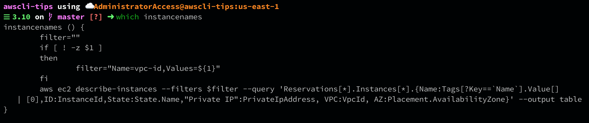
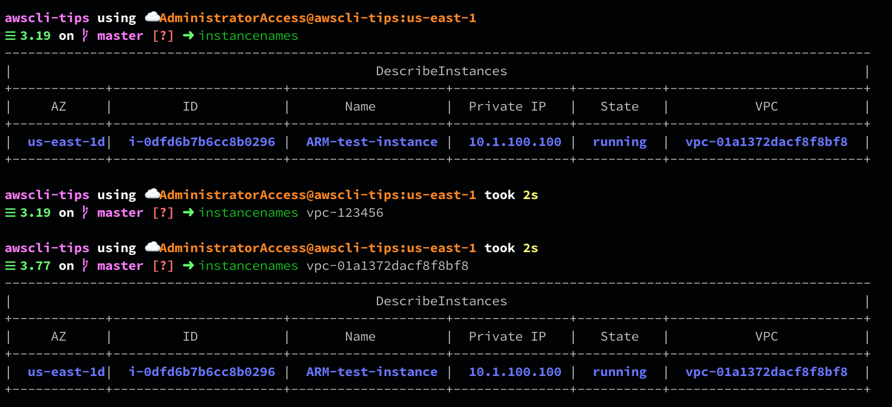

# instancenames

Get a high level overview of your instances, optionally filtered by VPC
Useful for quickly getting an idea of what instances you have running.

It's recommended to adjust the output to what is useful for you.

