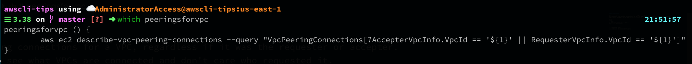
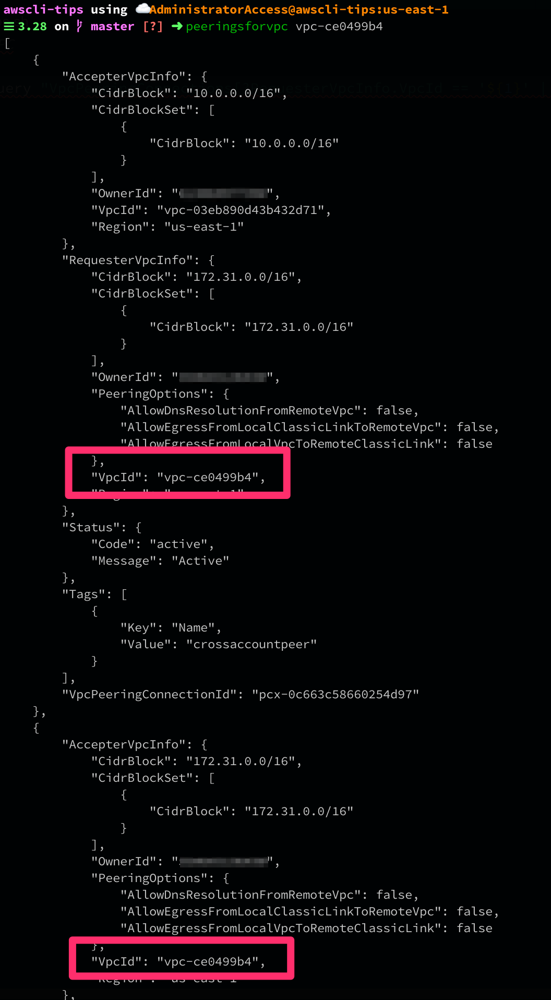

# peeringsforvpc

Retrieves all the peering connections for a VPC, regardless if it was the requester or accepter.
Useful when you want to see what VPCs are connected and don't care who requested it.

Usage:
```bash
$> peeringsforvpc vpc-12345678
[
    {
        "AccepterVpcInfo": {
            "CidrBlock": "10.0.0.0/16",
            "CidrBlockSet": [
                {
                    "CidrBlock": "10.0.0.0/16"
                }
            ],
            "OwnerId": "123456789012",
            "VpcId": "vpc-12345678",
            "Region": "us-east-1"
        },
```


