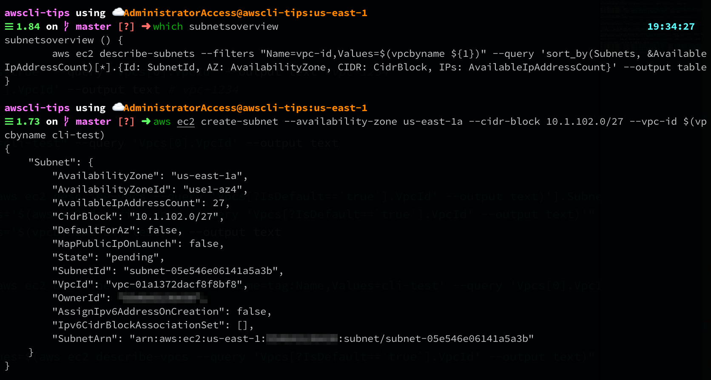
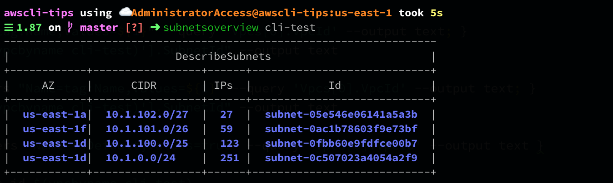

# subnetsoverview

Retrieves a quick and simple overview of your subnets, sorted by number available IPs. Uses vpcbyname.

```bash
$> subnetsoverview cli-test
--------------------------------------------------------------------
|                          DescribeSubnets                         |
+------------+-----------------+------+----------------------------+
|     AZ     |      CIDR       | IPs  |            Id              |
+------------+-----------------+------+----------------------------+
|  us-east-1a|  10.1.102.0/27  |  27  |  subnet-05e546e06141a5a3b  |
|  us-east-1f|  10.1.101.0/26  |  59  |  subnet-0ac1b78603f9e73bf  |
|  us-east-1d|  10.1.100.0/25  |  123 |  subnet-0fbb60e9fdfce00b7  |
|  us-east-1d|  10.1.0.0/24    |  251 |  subnet-0c507023a4054a2f9  |
+------------+-----------------+------+----------------------------+
```


