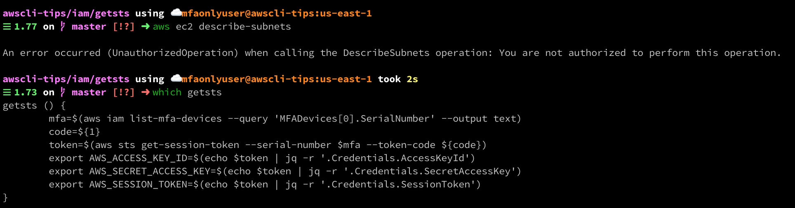
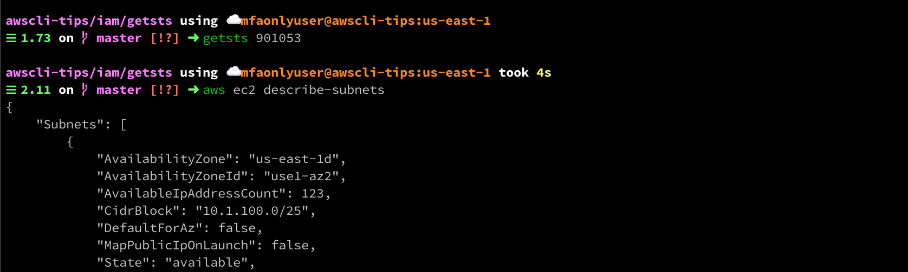

# getsts

Provides an STS token based on your current session + provided MFA token.
Useful when you're working in an account where you have an IAM user, but can only do things when you are logged in with MFA.

Usage:
```bash
$> getsts 123456
```


